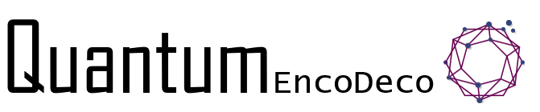

# QuantumEncoDeco



## Description
A Java framework for __encoding__ Knowledge Graphs (represented in RDF) as numeric data for being suitable to use for creating quantum states. It also supports the __decoding__ of results.

## How to Use
See the examples in the package ZClients https://github.com/YannisTzitzikas/QuantumEncoDeco/tree/main/encodeco/Zclients

## How to Cite
This framework is described in the following publication (under review):
```
@inproceedings{tzitzikas2025Quantum,
  title={Knowledge Graphs and Quantum Computing:  First Blood},
  author={Tzitzikas, Yannis and Kondylakis, Haridimos},
  booktitle={(submitted)},
  year={2025},
  organization={Springer}
}
```

## Next steps
Under continous evolution


