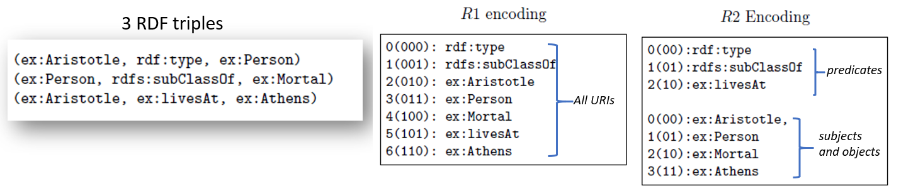

# QuantumEncoDeco


## Description
A Java framework for __encoding__ Knowledge Graphs (represented in RDF) as numeric data for being suitable to use for creating quantum states. It also supports the __decoding__ of results.
The basic idea of the encodings can be illustrated as:



## How to Use

QuantumEncoDeco provides a Fluent API which allows us to define powerful Workflows which can be used for more than Encoding and Decoding. Here is a simple example:

```java
public class NumberSplitterExample {

    public void runNumberPipeline() throws Exception {
        // 1. Initialize the stream graph environment
        StreamEnvironment graph = new StreamEnvironment();

        // 2. Establish the base entry point stream
        StreamBuilder<Integer> numbersStream = graph.fromSource(() -> 
            Stream.generate(() -> random.nextInt(201) - 100) // random sequence (-100 to 100)
                  .limit(100)                                // Bounded limit parameter controls execution depth);
        )                             

        // -------------------------------------------------------------
        // BRANCH 1: Positive Numbers Processing
        // -------------------------------------------------------------
        numbersStream
            .filter(num -> num >= 0)                         // Filter out negatives
            .map(num -> num * 10)                            // Calculation: Multiply by 10
            .map(num -> "Positive Branch [x10] -> " + num)   // Format to String
            .sink();                                        

        // -------------------------------------------------------------
        // BRANCH 2: Negative Numbers Processing
        // -------------------------------------------------------------
        numbersStream
            .filter(num -> num < 0)                          // Filter out positives
            .map(num -> Math.abs(num))                       // Calculation: Absolute value
            .map(num -> "Negative Branch [Abs] -> " + num)   // Format to String
            .sink();                                         

        // 3. Trigger the graph execution engine
        graph.execute();
    }
}
```

For more complex pipeline architectures, check out the implemented examples:
* **R1 Layout Strategy:** View the [R1 Mapper](./src/test/java/com/csd/examples/r1/R1Mapper.java), [R1 Encoder](./src/test/java/com/csd/examples/r1/R1Encoder.java) and [R1 Decoder](./src/test/java/com/csd/examples/r1/R1Decoder.java).
* **R2 Layout Strategy:** View the [R2 Mapper](./src/test/java/com/csd/examples/r2/R2Mapper.java), [R2 Encoder](./src/test/java/com/csd/examples/r2/R2Encoder.java) and [R2 Decoder](./src/test/java/com/csd/examples/r2/R2Decoder.java).

## How to Cite
This framework is described in the following publication (under review):
```
@inproceedings{tzitzikas2025Quantum,
  title={Knowledge Graphs and Quantum Computing:  First Blood},
  author={Tzitzikas, Yannis and Kondylakis, Haridimos},
  booktitle={(submitted)},
  year={2025},
  organization={Springer}
}
```

## Future Work

Potential areas of improvements:
1. Decoupling the graph declaration API from the physical runtime engine execution.
2. Compiling and Serializing the graph Intermediate Representation.
3. Developping a Client CLI to manage resources and execution of given graphs.
